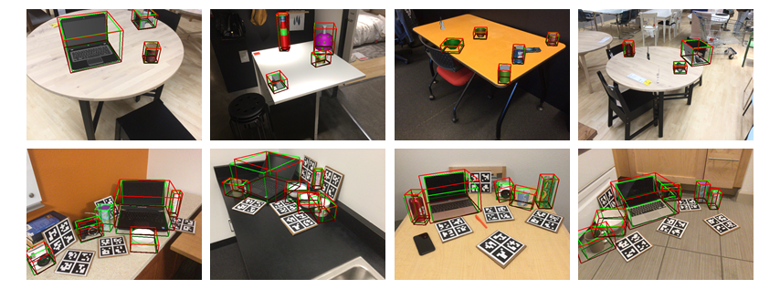

# Shape Prior Deformation for Categorical 6D Object Pose and Size Estimation


## Overview
This repository contains the PyTorch implementation of the paper "Shape Prior Deformation for Categorical 6D Object Pose and Size Estimation"
([arXiv](http://arxiv.org)).
Our approach could recover the 6D pose and size of unseen objects from an RGB-D image, as well as reconstruct their complete 3D models.

## Dependencies
* Python 3.6
* PyTorch 1.0.1
* CUDA 9.0

## Installation
```
ROOT=/path/to/object-deformnet
cd $ROOT/lib/nn_distance
python setup.py install --user
```

## Datasets
Download [camera_train](http://download.cs.stanford.edu/orion/nocs/camera_train.zip), [camera_val](http://download.cs.stanford.edu/orion/nocs/camera_val25K.zip),
[real_train](http://download.cs.stanford.edu/orion/nocs/real_train.zip), [real_test](http://download.cs.stanford.edu/orion/nocs/real_test.zip),
[ground-truth annotations](http://download.cs.stanford.edu/orion/nocs/gts.zip),
and [mesh models](http://download.cs.stanford.edu/orion/nocs/obj_models.zip)
provided by [NOCS](https://github.com/hughw19/NOCS_CVPR2019).<br/>
Unzip and organize these files in $ROOT/data as follows:
```
data
├── CAMERA
│   ├── train
│   └── val
├── Real
│   ├── train
│   └── test
├── gts
│   ├── val
│   └── real_test
└── obj_models
    ├── train
    ├── val
    ├── real_train
    └── real_test
```
Run python scripts to prepare the datasets.
```
cd $ROOT/preprocess
python shape_data.py
python pose_data.py
```
Notice that running the scripts will additionally shift and re-scale the models of mug category (w/o modifying the original files),
such that the origin of the object coordinate frame is on the axis of symmetry.
This step is implemented for one of our early experiments and turns out to be unnecessary.
Ignoring this step should make no difference to the performance of our approach.
We keep it in this repo for reproducibility.

## Training
```
# optional - train an Autoencoder from scratch and prepare the shape priors
python train_ae.py
python mean_shape.py

# train DeformNet
python train_deform.py
```

## Evaluation
Download the pre-trained models, segmentation results from Mask R-CNN, and predictions of NOCS from [here](https://drive.google.com/file/d/1p72NdY4Bie_sra9U8zoUNI4fTrQZdbnc/view?usp=sharing).
```
unzip -q deformnet_eval.zip
mv deformnet_eval/* $ROOT/results
rmdir deformnet_eval
cd $ROOT
python evaluate.py
```

## Citation
If you find our work helpful, please consider citing:
```
@article{tian2020eccv,
  title={Shape Prior Deformation for Categorical 6D Object Pose and Size Estimation},
  author={Tian, Meng and Ang Jr, Marcelo H and Lee, Gim Hee},
  year={2020}
}
```

## Acknowledgment
Our implementation leverages the code from [NOCS](https://github.com/hughw19/NOCS_CVPR2019) and [3PU](https://github.com/yifita/3PU_pytorch).
